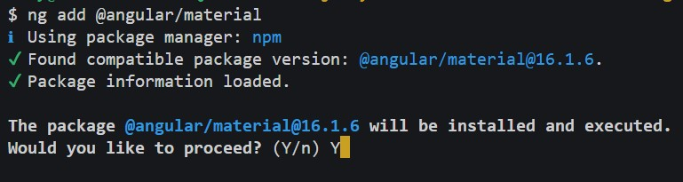
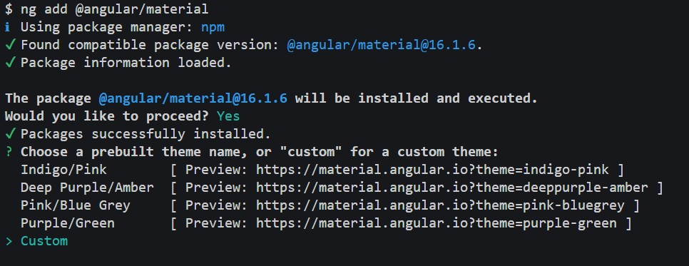
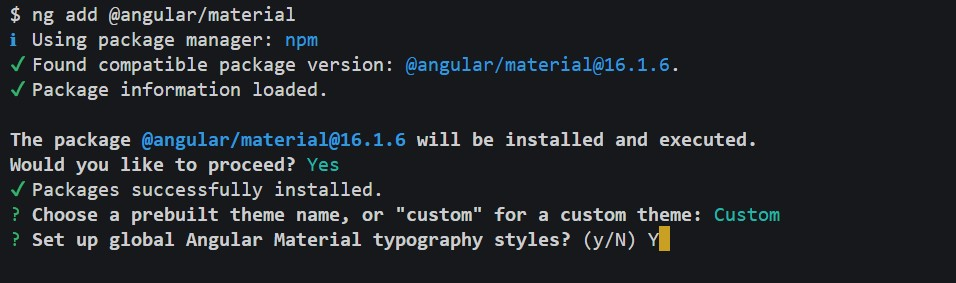
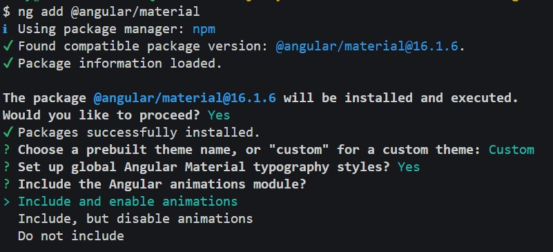

# Curso Angular 16 Mitocode

Este es un repositorio que se basa en la versión 16 de Angular, tengan en cuenta que las librerías que usemos pueden cambiar su implementación en el tiempo, asi que deben de adaptar el proyecto de acuerdo a esos cambios.

## Angular Material

Antes de instalar Angular material, asegurate de seleccionar la versión correcta según la versión de Angular de tu proyecto, en nuestro caso usaremos la versión 15:

```
ng add @angular/material
```

Cuando empieze a instalar nos arrojara un mensaje confirmando la versión de angular material, indicamos **Y**



Cuando se muestre la opción de escoger un tema, nosotros usaremos la opción **"custom"**



Cuando se muestre la opción de usar la typografia diremos que **Y**



y por ultimo nos pedira si usaremos browser animation, le diremos _Include and enabled animations_:



# Librerías extras

## jwt-decode

Esta librería nos servira para poder decodificar nuestro JWT

Instalamos la librería

```console
npm i jwt-decode
```

## costlydeveloper/ngx-awesome-popup

Esta librería nos servira para poder enviar notificaciones al usuario, tienes muchos efectos y la puedes personalizar a tu gusto, más información en https://costlydeveloper.github.io/ngx-awesome-popup/#/playground/toast-generator

Instalamos la librería

```console
npm i @costlydeveloper/ngx-awesome-popup
```

Para usar los estilos agregaremos lo siguiente en el archivo **style.scss**

```css
@import 'node_modules/@costlydeveloper/ngx-awesome-popup/styles/theme';
```

Tambien agregaremos unos cambios al archivo **angular.json** para que el archivo sea parte de la compilación de nuestro proyecto:

```json

 "styles": [
              "src/styles.scss",
              "node_modules/@costlydeveloper/ngx-awesome-popup/styles/theme.css"
            ]
```

## ngx-ui-loader

Esta librería nos servira para podr mostrar un "Loader" cada vez que se haga una peticíon http, la puedes usar para lo que necesites; más información en : https://www.npmjs.com/package/ngx-ui-loader

```console
npm i ngx-ui-loader
```

## PdfMaker

Esta librería nos permite crear archivos PDF, más información en https://pdfmakewrapper.org/

instalamos las siguientes librerías:

```console
npm i pdfmake@0.1.72 pdfmake-wrapper
```

```console
npm i -D @types/pdfmake
```

## ngx-charts

Esta librería nos permite crear graficos estadisticos, más información en https://swimlane.gitbook.io/ngx-charts/

```console
npm i @swimlane/ngx-charts
```

```console
npm i -D @types/d3-scale @types/d3-selection @types/d3-shape
```
